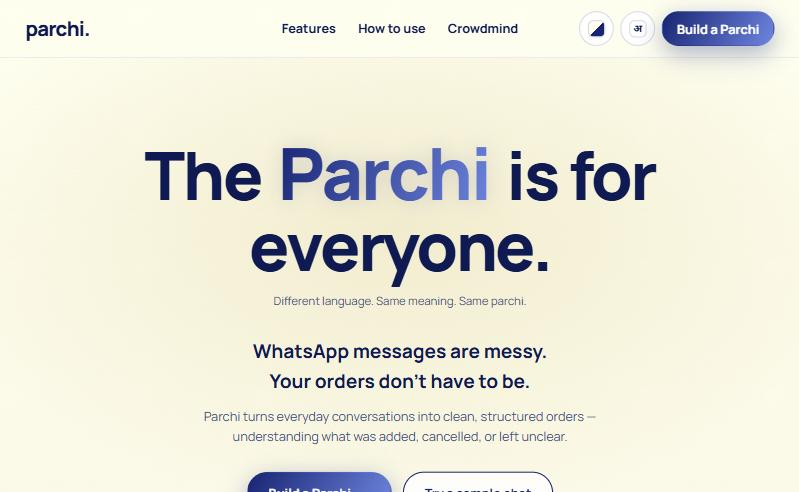
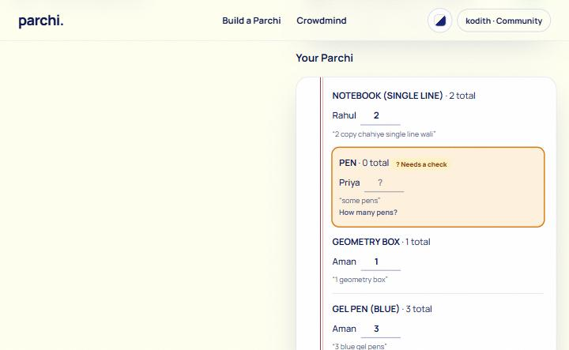

# Parchi

**From chat to clarity. Paste a messy WhatsApp chat, get one clean order, a proper bill, and a community in the loop.**

Parchi turns group chats full of "mere liye bhi ek le aana" into one grouped shopping list ("parchi"), with prices, who owes what, and a printable bill. Gemma 4 reads every message, including Hinglish, vague amounts, and cancellations. A second Gemma job runs **Crowdmind**, a community feed where shops, groups, and buyers share stock, offers, and quotes, with prices pulled out and scams blocked.

**Live demo:** https://parchi-self.vercel.app/

<p>
  
  
</p>

## The problem

In every hostel, class, society, or shop group, one person collects everyone's requests. The requests are:

- scattered across a long chat
- in Hinglish ("do pencil aur ek sharpener chahiye")
- vague ("some pens for me")
- changed later ("actually cancel the copies, I found mine")

Combining them by hand is slow and easy to get wrong. Working out who owes what, and making a bill, is worse.

## What it does

**Build a Parchi** ([/build](https://parchi-self.vercel.app/build))
1. **Paste the chat** or upload a WhatsApp "Export chat" `.txt`. Android, iOS, and copied formats all work.
2. **Gemma reads each message** and shows how it was read: Added, Cancelled, Ignored, or Needs a check.
3. **One parchi** groups everyone's requests: "copy" becomes Notebook, cancels are applied, chatter is ignored.
4. **Nothing is guessed.** "Some pens"? The row is flagged and asks "How many pens?" for the organiser to fill in.
5. **Type prices** to get line totals, the grand total, and **who owes what**.
6. **Copy the order for the shop**, copy who owes what, download a CSV, or **generate a bill**.

**Bills:** bill number, date (IST), amount in words in the Indian system ("Rupees Twelve Lakh…"), a per-person split for groups that adds up to the paisa, one bill per customer for shops. Print or save as PDF, or copy as text for WhatsApp.

**Roles:** Consumer, Community (a group), or Merchant (a shop). The role decides who your bills are from and to, and which Crowdmind space you read.

**Crowdmind:** a feed per space. Shops post stock and offers to buyers, groups call for orders, and anyone can ask for quotes. Gemma tags each post, writes a one-line summary, lists the prices quoted, and blocks scams (OTP, UPI PIN, advance-payment tricks). The server checks who may read and post in each space.

**Themes:** Parchi Classic, Vintage, and Mono. The landing page also has a Hindi translation.

## Gemma model used

**`gemma-4-26b-a4b-it`** (Gemma 4 26B A4B) through the **Gemini API**, using Google's official [`@google/genai`](https://www.npmjs.com/package/@google/genai) SDK. It's a mixture-of-experts model (about 4B parameters active per token), so each message comes back in about 2 seconds. Switch models with the `GEMMA_MODEL` environment variable.

Gemma does two jobs, both returning JSON that code validates with `zod` before trusting it:

| Job | Input → output | Files |
|---|---|---|
| **1. Read an order message** | one chat message → `{ intent, items[{name, variant, quantity, source}], unclear }` | [`lib/readMessage.ts`](lib/readMessage.ts), [`lib/prompt.ts`](lib/prompt.ts), [`app/api/parse/route.ts`](app/api/parse/route.ts) |
| **2. Check a Crowdmind post** | one post → `{ tag, summary, items[{name, variant, price, unit, source}], moderation }` | [`lib/crowdmind/checkPost.ts`](lib/crowdmind/checkPost.ts), [`lib/crowdmind/prompt.ts`](lib/crowdmind/prompt.ts), [`app/api/crowdmind/posts/route.ts`](app/api/crowdmind/posts/route.ts) |

Shared setup: [`lib/gemma.ts`](lib/gemma.ts) (client and model, the only file that calls Gemma) and [`lib/gemmaJson.ts`](lib/gemmaJson.ts) (one call, clean the JSON, validate, retry once). Settings: structured JSON output with a response schema, temperature 0.2, thinking level `MINIMAL`, SDK retries for 429/5xx, and **one fresh request per message**, never chat history. The API key stays on the server.

## What Gemma does vs what code does

| Gemma 4 | Plain code |
|---|---|
| Reads **one** message or post, in English, Hindi, or Hinglish | Splits the chat into messages, senders, and times |
| Decides: order, cancel, or chatter; tags posts and spots scams | Validates every answer with `zod` and checks each quoted phrase is really in the text |
| Names products, variants, quantities (or `null` if vague), and quoted prices | Applies cancels, groups items, and keeps a post's price only if it's written in its quote |
| Quotes the exact words it used, and asks when unsure | All prices, totals, splits, bills, permissions, and exports |

Gemma never sees the organiser's prices and never invents a quantity or price. Anything unclear is flagged for a person to fix. If Gemma can't check a Crowdmind post, the post isn't published.

## What we learned getting Gemma right

We test every prompt change with [`scripts/prompt-tests.mjs`](scripts/prompt-tests.mjs): 10 order messages and 6 Crowdmind posts, all passing.

- **Worked examples beat rules.** Gemma ignored written rules about vague amounts and cancels but followed a worked JSON example immediately. Crowdmind kept "copy" as "copy" until one example showed copy → notebook.
- **`MINIMAL` thinking matters.** With thinking off, Gemma sometimes repeated items or broke the JSON. `MINIMAL` fixed it at the same speed.
- **Trust, but check.** Code drops repeated items, flags quotes that aren't in the message, and retries Google's occasional "500" errors (about 1 call in 7).

## AI usage credit

- **At runtime**, the app uses **Gemma 4 (`gemma-4-26b-a4b-it`) via the Gemini API** to read every chat message and every Crowdmind post.
- **While building**, the code, tests, and this README were written with help from **[Claude Code](https://claude.com/claude-code) (Anthropic)** as a pair programmer, working from the project specs in [`CLAUDE.md`](CLAUDE.md) and [`FEATURES_V2.md`](FEATURES_V2.md).

**Honesty note:** roles are self-chosen for the demo. A real launch needs verified merchant accounts.

## Tech stack

Next.js 16 (App Router), React 19, TypeScript, Tailwind CSS 4, `zod`, `@google/genai`, Supabase (Crowdmind posts), Vitest, and Vercel. Details in [docs/TECH_STACK.md](docs/TECH_STACK.md).

## Setup

You need Node.js 20 or newer and a Gemini API key from [Google AI Studio](https://aistudio.google.com/apikey).

1. Clone and install:
   ```bash
   git clone https://github.com/veeviiiii/Parchi.git
   cd Parchi
   npm install
   ```
2. Create `.env.local` in the project folder:
   ```
   GEMINI_API_KEY=your-key-here
   # optional:
   GEMMA_MODEL=gemma-4-26b-a4b-it
   # optional, for Crowdmind posts that persist (otherwise posts live in memory):
   SUPABASE_URL=https://xxxx.supabase.co
   SUPABASE_SECRET_KEY=sb_secret_...
   ```
   `.env.local` is in `.gitignore`, so keys are never committed. For Supabase, run the SQL in [`FEATURES_V2.md`](FEATURES_V2.md) section 9 first.
3. Start the app:
   ```bash
   npm run dev
   ```
   Open http://localhost:3000, click **Build a Parchi**, then **Load sample chat** and **Build order**.

Tests: `npx vitest run` (unit tests) and `node scripts/prompt-tests.mjs` (Gemma prompt tests against the running app).

## Deploy on Vercel

Import the GitHub repo on [vercel.com](https://vercel.com), add `GEMINI_API_KEY`, `SUPABASE_URL`, and `SUPABASE_SECRET_KEY` under Environment Variables, and deploy. Every push to `main` redeploys.

## Project structure

```
app/
  page.tsx                  landing page
  build/page.tsx            Build a Parchi (the order builder)
  crowdmind/page.tsx        community feed for your role's space
  bill/[id]/page.tsx        printable bill
  start/page.tsx            pick your role
  api/parse/route.ts        Gemma job 1: read one message
  api/crowdmind/posts/      Gemma job 2: check a post; feed by space
components/                 Builder, AppHeader, Menus (theme, language), RoleGate
lib/
  gemma.ts, gemmaJson.ts    Gemma client and the shared JSON helper
  readMessage.ts, prompt.ts, schema.ts   job 1
  crowdmind/                job 2: prompt, schema, store (Supabase or memory), seed posts
  parseChat.ts              chat text → messages
  aggregate.ts              answers → grouped order (cancels, flags)
  money.ts, bill.ts         prices, totals, who owes what, bills
  roles.ts, profile.ts      roles and the access matrix
```

## License

[MIT](LICENSE)
