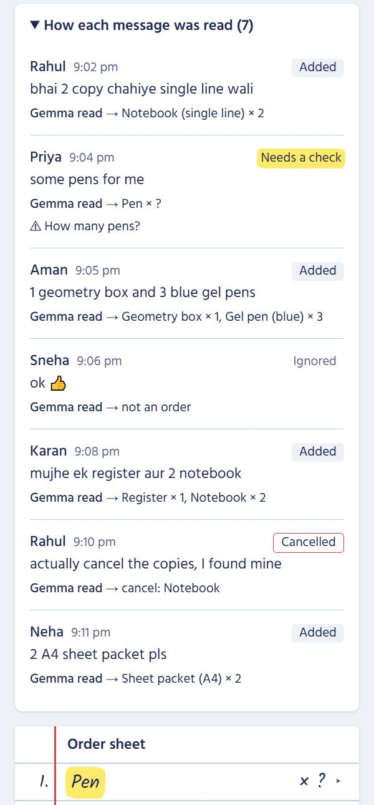
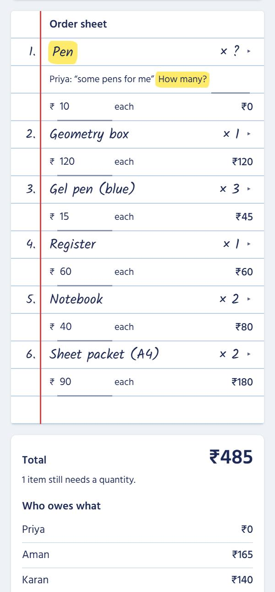

# Buy Together

**Paste your group chat. Get one clean order.**

Buy Together turns a messy group chat full of "mere liye bhi ek le aana" into one grouped shopping list, with prices and who owes what. Gemma 4 reads every message, including Hinglish, vague amounts, and people changing their minds.

**Live demo:** _add the Vercel link here after deploying (see [Deploy on Vercel](#deploy-on-vercel))_

<p>
  
  
</p>

## The problem

In every hostel, class, or club group, one person collects everyone's requests before going to the shop. The requests are:

- scattered across a long chat
- in Hinglish ("do pencil aur ek sharpener chahiye")
- vague ("some pens for me")
- changed later ("actually cancel the copies, I found mine")

Combining them by hand is slow and easy to get wrong. Working out who owes what afterwards is worse.

## What it does

1. **Paste the chat** or upload a WhatsApp "Export chat" `.txt` file. Android, iOS, and copied-from-WhatsApp formats all work.
2. **Gemma reads each message** and the app shows how each one was read: Added, Cancelled, Ignored, or Needs a check.
3. **One order sheet** groups everyone's requests: "copy" becomes Notebook, cancellations are applied, and chatter like "ok 👍" is ignored.
4. **Nothing is guessed.** If someone says "some pens", Gemma doesn't invent a number. The row is marked with a highlighter and asks "How many?", and the organiser types it in.
5. **Type prices** and every line total, the grand total, and **who owes what** update instantly.
6. **Copy the order for the shop** and **copy who owes what** for the group, ready to paste into WhatsApp. There's also a CSV download.

Work is saved in the browser, so a refresh doesn't lose the order.

## Gemma model used

**`gemma-4-26b-a4b-it`** (Gemma 4 26B A4B) through the **Gemini API**, using Google's official [`@google/genai`](https://www.npmjs.com/package/@google/genai) SDK.

It's a mixture-of-experts model: only about 4B parameters are active per token, so each message comes back in about 2 seconds. You can switch models with the `GEMMA_MODEL` environment variable (fallback: `gemma-4-31b-it`).

Where it's integrated:

| File | What it does |
|---|---|
| [`lib/gemma.ts`](lib/gemma.ts) | SDK client, model name, request settings, retries. The only file that calls Gemma. |
| [`lib/prompt.ts`](lib/prompt.ts) | The system prompt and its worked examples. |
| [`app/api/parse/route.ts`](app/api/parse/route.ts) | The server route the browser calls. The API key never reaches the browser. |

Request settings: structured JSON output with a response schema, temperature 0.2, thinking level `MINIMAL`, no tools, and **one fresh request per message** with no chat history.

## What Gemma does vs what code does

| Gemma 4 | Plain code |
|---|---|
| Reads **one** message at a time, in English, Hindi, or Hinglish | Splits the chat into messages, senders, and times |
| Decides if it's an order, a cancel, or just chatter | Checks Gemma's JSON with `zod`, and checks every quoted phrase really is in the message |
| Names each product, its variant, and its quantity (or `null` if vague) | Applies cancellations in chat order and groups the same items |
| Quotes the exact words it used, and asks a question when unsure | Handles all prices, totals, who owes what, and the copy/CSV exports |

Gemma never sees prices and never invents a quantity. Anything unclear is flagged for the organiser to fix.

## What we learned getting Gemma right

We tested every prompt change against 10 test messages and the demo chat, several runs each:

- **Worked examples beat rules.** Gemma ignored written rules about vague amounts and cancels, but followed a worked JSON example immediately. "3 black pens and 1 red" was read as 1 black pen every time until one similar example was added.
- **`MINIMAL` thinking matters.** With thinking off, Gemma sometimes repeated items or broke the JSON, and dropped "packet" from "2 A4 sheet packet". `MINIMAL` fixed all three at the same speed.
- **Trust, but check.** Code drops repeated items, flags any item whose quote isn't in the message, and retries Google's occasional "500" errors (about 1 call in 7 in our tests).

## AI usage credit

- **At runtime**, the app uses **Gemma 4 (`gemma-4-26b-a4b-it`) via the Gemini API** to read every chat message.
- **While building**, the code, tests, and this README were written with help from **[Claude Code](https://claude.com/claude-code) (Anthropic)** as a pair programmer, working from the project spec in [`CLAUDE.md`](CLAUDE.md). Commits it helped with are marked `Co-Authored-By: Claude`.

## Setup

You need Node.js 20 or newer and a Gemini API key from [Google AI Studio](https://aistudio.google.com/apikey).

1. Clone the repo:
   ```bash
   git clone <this-repo-url>
   cd buy-together
   ```
2. Install packages:
   ```bash
   npm install
   ```
3. Create a file called `.env.local` in the project folder:
   ```
   GEMINI_API_KEY=your-key-here
   # optional, this is the default:
   GEMMA_MODEL=gemma-4-26b-a4b-it
   ```
   `.env.local` is in `.gitignore`, so your key is never committed.
4. Start the app:
   ```bash
   npm run dev
   ```
   Open http://localhost:3000, click **Load sample chat**, then **Build order**.

Run the tests with `npx vitest run`.

## Deploy on Vercel

1. Push the repo to GitHub. Check `.env.local` is **not** in it.
2. On [vercel.com](https://vercel.com), choose **Add New → Project** and import the GitHub repo. Vercel detects Next.js by itself.
3. Under **Environment Variables**, add `GEMINI_API_KEY` (and optionally `GEMMA_MODEL`).
4. Click **Deploy**, then paste the link at the top of this README.

## Project structure

```
app/
  page.tsx              the single page; state and the build loop live here
  api/parse/route.ts    the only route that calls Gemma
components/             PastePanel, MessageList, OrderSheet, Summary
lib/
  gemma.ts, prompt.ts   Gemma client and prompt
  schema.ts             zod schema + cleanup and guards for Gemma's answer
  parseChat.ts          chat text → messages
  aggregate.ts          answers → grouped order (cancels, flags)
  money.ts              prices, totals, who owes what
  exports.ts            shop text, who-owes text, CSV
```

Built with Next.js, TypeScript, Tailwind CSS, `zod`, and `vitest`.

## License

[MIT](LICENSE)
